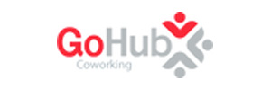
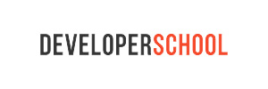

##Dashboard Seed v0.1.94093.72

Esse aplicativo tem como objetivo criar um boot para projetos que precisem de gerenciamento de usuários e área exclusiva. É quase que um "big snippet" de código para quem quiser começar um site ou serviço. É como um "trabalho de conclusão de curso" para mim, pois estou aplicando neles meus estudos em Node. Ele está sendo utilizado em outro projeto privado que estou fazendo, mas as coisas globais estou atualizando aqui e dividindo com quem tiver interesse.

Usaremos nesse projeto:
* Node.js
* mongoDB (servidor local)
* Express.js
* Diversos módulos
  * express-handlebars
  * passport
  * assert
  * mongoose
  * etc.

###Conceitos gerais

O projeto tem como objetivo ser crossbrowser e prover um pacote base para utilização também em responsivo, além de servir de laboratório para automatização de testes automatizados para ambas as áreas. Escolhemos utilizar alguns serviços online para isso e o [BrowserStack.com](https://www.browserstack.com) foi o que demonstrou possuir ótima ferramentas, possibilidade de escalonamento e preços justos.

##Escopo Geral para a versão 1.0

O escopo de ferramentas que farão parte desse app são:
* Configuração inicial de servidor
* Cadastro de usuário
  * E-mail
  * Senha
  * Avatar (com Gravatar)
* Acesso do usuário
  * Login e Sign out
* Recuperação de senha (``/forgot``)
  * Reset password com token
* Área personalizada (``/profile``)
  * Avatar
  * Informações básicas
  * Edição de informações (``/profile/edit``)
  * Criar profile por user ID ou User name (``/profile/12313123`` || ``/profile/bellentani``)
    * Criar profile com apelido (quando o campo ``alias`` estiver preenchido no banco, senão usará o ID)
    * Quando criar o campo ``alias`` precisaremos checar se ele está sendo usado, porque ele também será um registro único (registros únicos são ``id``,``email`` e ``alias``).
* Tela de usuário
  * Pública
  * Escolha de itens que podem ser exibidos (privacidade)
* Área administrativa (``/profile/::user::admin``)
  * Níveis de usuário (user, admin, owner)
  * Relatório de atividade gerais dos usuários (logs)

##Apoio

Alguns serviços que usamos de forma gratuíta e parceiros que fornecem espaço físico para nossas reuniões.

   

##Agradecimentos

A todos os interessados na proposta e envolvidos, desde aqueles que já brincaram colocando algumas linhas no código até aqueles que participaram dos bate papos iniciais.
